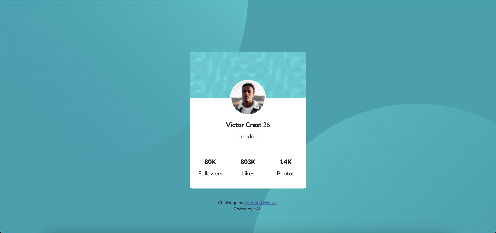
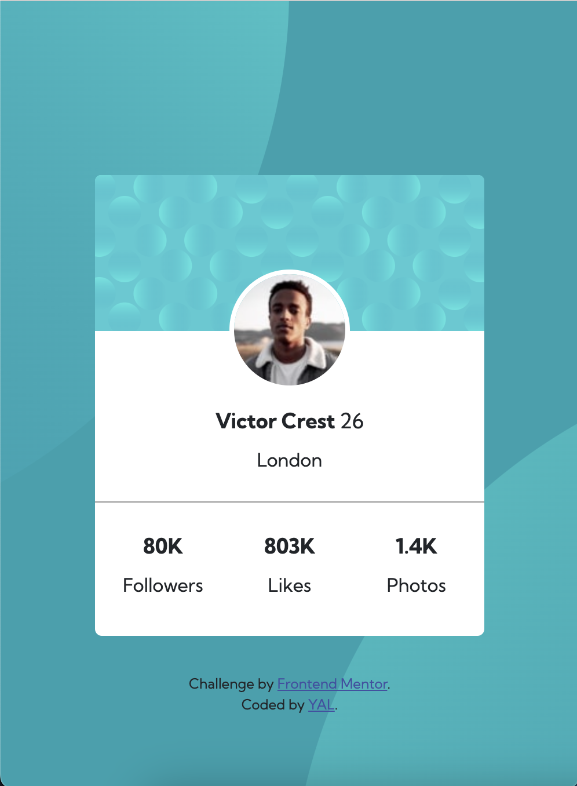

# Frontend Mentor - Profile card component solution

This is a solution to the [Profile card component challenge on Frontend Mentor](https://www.frontendmentor.io/challenges/profile-card-component-cfArpWshJ). Frontend Mentor challenges help you improve your coding skills by building realistic projects. 

## Table of contents

- [Overview](#overview)
  - [Screenshot](#screenshot)
  - [Links](#links)
- [My process](#my-process)
  - [Built with](#built-with)
  - [What I learned](#what-i-learned)
  - [Continued development](#continued-development)
- [Author](#author)
- [Acknowledgments](#acknowledgments)

## Overview
### Screenshot

### Links
- [Live Site URL: [Add live site URL here]](https://yacodingroom.github.io/Profile-card-component/)

## My process
### Built with
- Semantic HTML5 markup
- CSS custom properties
- Bootstrap

### What I learned
定位 - position
這件事真的讓我焦頭爛額，寫到後來直接迷失，關於定位我要重新學習了。

### Continued development
All about position.

## Author
- Frontend Mentor - [@YAcodingroom]
(https://www.frontendmentor.io/profile/YAcodingroom)
- Threads - [@nt19_lya](https://www.threads.net/@nt19_lya)

## Acknowledgments
感謝Angela老師，感謝靜文老師，感謝Google，感謝Bootstrap，感謝宇宙。
最近買了一本超新手的書，補齊了自學期間沒有弄懂的標籤，感謝自己的好學。
